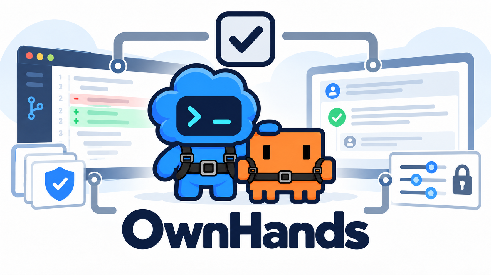
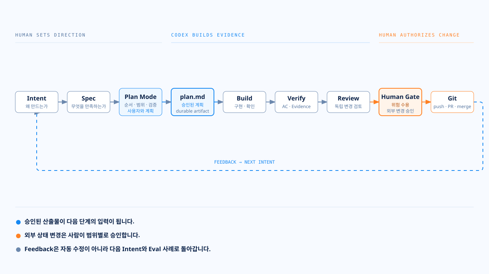
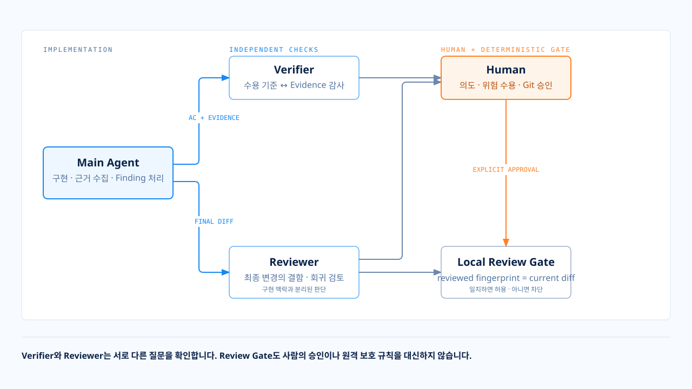
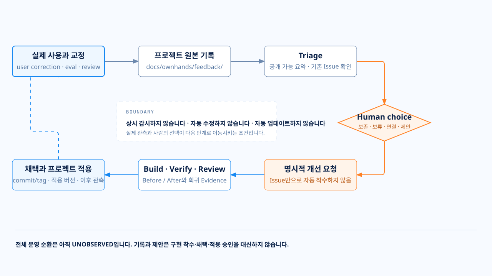

<p align="center">
  
</p>

<h1 align="center">OwnHands</h1>

<p align="center">
  <a href="https://www.npmjs.com/package/ownhands"></a>
  <a href="LICENSE"></a>
  <a href="#시작하기"></a>
  <a href="#스킬"></a>
  <a href="#독립-검토"></a>
</p>

<p align="center">
  <strong>AI가 구현해도, 개발의 주도권은 내 손에.</strong><br />
  의도를 설계로, 구현을 검증 근거로, 사용 경험을 다음 개선으로 연결합니다.
</p>

<p align="center">
  <a href="#시작하기">시작하기</a> ·
  <a href="#개발-흐름">개발 흐름</a> ·
  <a href="#스킬">스킬</a> ·
  <a href="#검증과-승인">검증과 승인</a> ·
  <a href="#현재-상태">현재 상태</a>
</p>

---

## 코드를 맡긴 뒤에도, 이해와 판단은 남습니다

AI가 코드를 만드는 동안, 사람에게는 다른 질문이 남습니다.

**왜 이렇게 구현했을까? 무엇을 확인했을까? 이 변경을 받아들여도 될까?**

OwnHands는 이 질문에 답할 근거를 개발 과정에 남기는 **개발 하네스**입니다. Codex의 스킬·서브에이전트·계획 모드와 Git을 연결해, 사람이 의도를 정하고 결과를 이해하며 다음 행동을 결정하도록 돕습니다.

| 사람이 해야 할 일 | OwnHands가 돕는 방식 |
|---|---|
| **이해하기** | 의도·설계·계획을 구분하고, 필요한 순간에는 그림 중심의 HTML로 설명합니다. |
| **검증하기** | 완료 주장과 실행 근거를 대조하고, 확인한 것과 확인하지 못한 것을 나눕니다. |
| **결정하기** | 리뷰 의견의 수용·기각 근거를 남기고, 외부 상태 변경 전에 사람의 승인을 받도록 안내합니다. |

별도의 코딩 에이전트나 상시 실행 서버를 만드는 것이 아닙니다. **이미 사용하는 개발 도구 사이에 필요한 연결과 기준을 더합니다.**

<a id="개발-흐름"></a>

## 한 작업이 이어지는 방식

대화에서 합의한 내용을 다음 단계가 읽을 수 있는 문서로 남깁니다. 구현한 뒤에는 그 문서의 수용 기준과 실제 검증 근거를 다시 대조합니다.

<p align="center">
  
</p>

### 문서 세 개, 서로 다른 질문

| 산출물 | 담는 내용 |
|---|---|
| `intent.md` | **왜 만드는가?** 문제, 목표, 하지 않을 일, 제약을 정합니다. |
| `spec.md` | **무엇을 만족해야 하는가?** 설계, 인터페이스, 예외, 수용 기준을 정합니다. |
| `plan.md` | **어떻게 구현하고 확인할 것인가?** 변경 파일, 작업 순서, 검증 방법을 남깁니다. |

구현 계획은 **Codex의 계획 모드**에서 논의합니다. `plan.md`는 그 모드를 대신하는 기능이 아니라, **사용자가 승인한 계획을 저장하는 문서**입니다.

사용자 선택에 따라 결과가 달라지는 부분은 문서 전체가 완성되기 전에 함께 검토합니다. 코드에서 확인할 수 있는 사실까지 사용자에게 다시 묻지는 않습니다. 사소한 수정에 이 전체 절차를 일괄 강제하는 것도 목표가 아닙니다.

자세한 산출물 규약은 [의도·설계·계획 작성 가이드](docs/specs/README.md)를 참고합니다.

<a id="시작하기"></a>

## 시작하기

현재 CLI의 선언된 요구 조건은 **Node.js 18 이상, Git 저장소, 대상 프로젝트의 파일 쓰기 권한**입니다. 스킬을 사용하는 단계에서는 Codex 실행 환경도 필요합니다.

### 1. 사용할 프로젝트에 연결

**연결할 프로젝트의 Git 저장소 안에서** 실행합니다.

```bash
npx --yes ownhands@0.0.1 init
npx --yes ownhands@0.0.1 doctor
npx --yes ownhands@0.0.1 eval --static-only
```

`init`은 스킬·에이전트·Review Hook/Gate·소비자용 Eval을 추가하고, 기존 `AGENTS.md`와 훅 설정에는 OwnHands 항목을 병합합니다. **같은 경로에 다른 내용이 있으면 덮어쓰지 않고 중단합니다.**

`doctor`는 설치 파일과 설정을 읽기 전용으로 검사합니다. 정상으로 나와도 **Codex가 훅을 신뢰하고 실제 실행했는지까지 확인한 것은 아닙니다.**

`eval --static-only`는 설치 계약만 확인하고 모델을 호출하지 않습니다. `eval`을 옵션 없이 명시적으로 실행할 때만 Codex Runtime 항목을 관측합니다.

### 2. Codex에서 첫 작업 시작

설치한 프로젝트를 Codex로 열고, 만들고 싶은 기능부터 설명합니다.

```text
$grill-spec 이 프로젝트에 추가할 기능의 목표와 범위를 함께 정리해줘.
현재 구현에서 확인할 수 있는 사실과 내가 결정해야 할 것을 구분해줘.
```

설계를 승인한 뒤에는 Codex 계획 모드에서 구현 순서와 검증 방법을 정합니다. 계획까지 승인하면 `$build`로 구현을 시작합니다.

설치 자산, 충돌 처리, Eval 경계와 안전한 수동 제거는 [설치 계약](docs/installation.md)에 정리했습니다. 현재 CLI는 `init`, `doctor`, `eval`만 제공하며, 자동 업데이트·마이그레이션·제거 명령은 제공하지 않습니다.

<a id="스킬"></a>

## 필요한 순간에 쓰는 7가지 스킬

스킬은 작업의 진입점이고, 자세한 방법과 정책은 각 스킬의 참고 문서에 둡니다. 모든 지침을 매번 한꺼번에 읽히는 대신, 해당 작업에 필요한 내용을 연결합니다.

### 설계부터 검토까지

| 스킬 | 사용할 때 | 남기는 결과 |
|---|---|---|
| [`grill-spec`](.agents/skills/grill-spec/SKILL.md) | 목표·범위·설계를 함께 정할 때 | 의도와 명세, 사용자 결정, 계획 모드 인계 |
| [`build`](.agents/skills/build/SKILL.md) | 승인된 계획을 구현할 때 | 작업별 구현과 검증 근거, `verify` 인계 |
| [`verify`](.agents/skills/verify/SKILL.md) | 요구사항을 충족했는지 확인할 때 | 수용 기준별 근거와 독립 감사 결과 |
| [`review`](.agents/skills/review/SKILL.md) | 검증된 변경을 독립적으로 검토할 때 | 리뷰 지적의 처리 기록, 검토 증거, 사람의 승인 요청 |

### 이해·기록·개선

| 스킬 | 사용할 때 | 남기는 결과 |
|---|---|---|
| [`explain`](.agents/skills/explain/SKILL.md) | 복잡한 구조나 현재 상황을 시각적으로 이해할 때 | 그림 중심의 단일 HTML 설명 |
| [`write-issue-pr`](.agents/skills/write-issue-pr/SKILL.md) | 이슈나 PR 본문을 작성·수정할 때 | 짧은 핵심 요약과 접힌 상세 근거 |
| [`feedback`](.agents/skills/feedback/SKILL.md) | 사용 중 교정·평가 실패·리뷰 지적을 관측했을 때 | 프로젝트의 피드백 기록과 OwnHands 개선 후보 |

### 설명이 필요하면, 설명만 요청합니다

```text
$explain 현재 구조에서 각 에이전트가 어떤 역할인지 설명해줘.
```

명시적으로 `explain`을 선택하면 HTML을 기본으로 만듭니다. 텍스트만 원하거나 파일 생성·표시가 부적절한 환경에서는 이유를 밝히고 대화형 설명을 제공합니다.

일반적인 “설명해줘” 요청까지 이 스킬을 자동 호출하지는 않습니다. 생성된 HTML은 **그 시점의 자료를 설명한 결과물**이며, 이후 변경을 자동 반영하는 대시보드도 정식 검증 결과도 아닙니다.

<a id="독립-검토"></a>

## 구현한 에이전트와 검토하는 역할을 나눕니다

| 서브에이전트 | 맡는 질문 | 책임 |
|---|---|---|
| `researcher` | 판단하기 전에 무엇을 알아야 하는가? | 자료·코드·1차 출처를 조사하고 사실과 미확인을 구분합니다. |
| `verifier` | 이 근거로 수용 기준 충족을 말할 수 있는가? | 명세와 기록된 검증 근거를 독립적으로 대조합니다. |
| `reviewer` | 변경 자체에 놓친 문제는 없는가? | 최종 변경의 결함·회귀·과도한 설계를 검토합니다. |

현재 세 역할의 기본 샌드박스는 **읽기 전용**입니다. 모델과 추론 강도는 [역할별 모델 정책](.codex/agents/model-policy.md)에 따라 호출할 때 명시하도록 구성했습니다. 요청한 설정과 실제 실행에서 확인한 값은 구분합니다.

리뷰어의 말이 곧 수정 명령은 아닙니다. 메인 에이전트가 코드·설계·근거와 대조해 **수용하거나, 근거를 남겨 기각하거나, 사용자에게 판단을 요청**합니다. 승인된 의도와 정책을 리뷰어의 의견만으로 바꾸지 않습니다.

<p align="center">
  
</p>

<a id="검증과-승인"></a>

## 완료라는 말 대신, 근거를 남깁니다

테스트 출력, 정적 검사, 화면 관측, 전후 비교처럼 **작업에 맞는 실제 근거**를 남깁니다. 성공적으로 명령이 끝났다는 사실만으로 요구사항 전체가 충족됐다고 판단하지 않습니다.

| 판정 | 의미 |
|---|---|
| `PASS` | 해당 수용 기준을 충족한다는 근거를 확인했습니다. |
| `FAIL` | 실행 실패나 기대와 다른 동작 등 문제를 관측했습니다. |
| `UNOBSERVED` | 실행·관측하지 않았거나, 판단할 근거를 확보하지 못했습니다. |

**확인하지 못했다는 것은 통과했다는 뜻이 아닙니다.** 평가에서 회귀가 없었다는 것 역시 모든 기능이 정상이라는 뜻은 아닙니다.

### 서로 다른 두 대상을 검증합니다

| 대상 | 확인하는 것 |
|---|---|
| **개발 중인 제품** | 요구사항 충족과 기존 동작 보존을 프로젝트의 테스트·검사·관측으로 확인합니다. |
| **제품을 만드는 에이전트 구성** | 스킬·지침·모델 정책이 바뀌었을 때 대표 과제의 결과가 어떻게 달라졌는지 평가합니다. |

OwnHands의 평가 과제를 사용 프로젝트마다 강제로 복사하거나, 매 작업마다 전체 모델 실행 평가를 돌리는 구조는 아닙니다. [평가 계약](docs/adr/0009-continuous-evals-task-set-and-runner.md)에서 검사 범위와 기준선을 구분합니다.

### 리뷰한 변경과 내보낼 변경을 대조합니다

로컬 리뷰 게이트는 검토 당시의 변경 상태를 지문값인 **`fingerprint`**로 기록하고, 지원하는 외부 Git 명령 전에 현재 상태와 비교합니다. 검토 뒤 변경이 생겼거나 유효한 증거가 없으면 차단하도록 구현했습니다.

다만 **지침, 로컬 훅, 사람의 승인은 서로 다른 층**입니다. 로컬 훅이 모든 실행 경로를 통제하거나 원격 저장소의 보호 규칙을 대체하지는 않습니다. 실제 Codex에서의 신뢰·실행 여부도 별도로 확인해야 합니다.

원격 푸시와 PR 생성, 병합, 배포, 브랜치 정리는 각각 해당 범위의 승인을 받아야 합니다. 앞 단계의 승인을 다음 단계까지 허용한 것으로 해석하지 않습니다.

<a id="함께-성장하기"></a>

## 사용하면서, 개발 방식도 함께 바꿉니다

OwnHands는 한 번 완성하고 끝내는 도구가 아닙니다. **AI와 개발하며 얻은 경험을 다음 작업 방식에 반영하면서 함께 성장하는 도구**를 지향합니다.

“설명이 너무 복잡하다”, “리뷰의 비용이 부담된다”, “필요한 확인을 놓쳤다” 같은 교정은 개선의 출발점이 될 수 있습니다. 그렇다고 모든 불편을 OwnHands의 결함으로 단정하거나, 발견 즉시 자동 수정하지는 않습니다.

`feedback`은 기대한 행동과 실제 관측을 **사용 프로젝트의 `docs/ownhands/feedback/`**에 남기고, 후속 검토에서 기록만 보존할지·전달을 보류할지·기존 이슈와 연결할지·새 이슈로 제안할지 구분합니다.

공개할 수 없는 정보는 분리하고, **이슈 등록과 개선 착수 승인을 구분**합니다. 실제 수정은 사용자가 요청한 뒤 기존 구현·검증·리뷰 흐름으로 진행합니다. 이후에는 채택한 변경과 사용 프로젝트에 적용한 버전까지 연결하도록 안내합니다.

<p align="center">
  
</p>

개선 방향을 미리 모두 정해두기보다, **실제로 겪은 문제가 다음 변경의 이유가 되도록** 만듭니다. 자세한 경계는 [피드백 기록·전달 계약](.agents/skills/feedback/references/feedback-contract.md)에 있습니다.

<a id="설계-방향"></a>

## 더 많은 통제보다, 필요한 연결을 만듭니다

OwnHands는 코딩 에이전트로 구현하는 동안, 결과를 이해하고 검토하는 일이 새로운 부담이 되는 경험에서 출발했습니다.

해결 방법을 찾으며 [Superpowers](https://github.com/obra/superpowers)의 개발 방법론을 스킬로 구성하는 접근을 사용하고 참고했습니다. 이후 [Anthropic의 AI 기반 개발 생명주기 플레이북](https://claude.com/blog/the-ai-native-sdlc-playbook)을 접하면서, 코드 작성이 빨라질수록 기획·검토·배포 등 앞뒤 단계가 중요해진다는 관점으로 기존 고민을 확장했습니다. [공식 강의](https://academy.claude.com/courses/ai-native-sdlc-playbook)에서도 이 단계들과 산출물의 연결을 설명합니다.

처음에는 검증과 설명을 위한 별도 시스템을 늘렸습니다. 하지만 어느 순간부터 **개발을 돕는 도구를 유지하는 일이, 개발 자체보다 무거워질 수 있다는 한계**를 경험했습니다.

지금은 실행 플랫폼이 제공하는 기능을 먼저 사용하고, 남은 연결부만 직접 만듭니다.

| 원칙 | 선택 |
|---|---|
| **기존 기능을 먼저 사용합니다.** | Codex의 계획 모드·스킬·서브에이전트·권한을 우선 활용합니다. |
| **작업 경계를 나눕니다.** | 독립된 작업은 스킬로, 그 안의 자세한 방법은 참고 문서로 둡니다. |
| **지침과 강제를 구분합니다.** | 행동 안내와 스크립트 검사, 사람의 승인에 서로 다른 책임을 줍니다. |
| **관측한 만큼만 말합니다.** | 실행한 검사와 미확인 동작, 요청한 모델과 관측한 모델을 구분합니다. |

Superpowers를 그대로 복제하거나 Playbook의 모든 자동화를 구현하는 것이 목적은 아닙니다. **OwnHands에 필요한 원칙을 현재 실행 환경과 사용 경험에 맞게 적용합니다.**

설계 배경은 [프로젝트 여정](docs/story/project-journey.md), 적용한 원칙은 [Playbook 대응 문서](docs/references/anthropic-playbook.md)에서 확인할 수 있습니다.

<a id="현재-상태"></a>

## 현재 상태

**핵심 작업 흐름과 설치 CLI를 구현했으며, 첫 실제 프로젝트의 전체 흐름 검증을 준비하고 있습니다.**

| 구분 | 현재 확인한 범위 |
|---|---|
| **구현** | 7개 스킬, 3개 독립 역할, 계획 모드 인계, 평가·리뷰 검사, `init`·`doctor`·`eval` |
| **로컬 검증 기록** | 결정론적 테스트, 정적 평가, 로컬 tarball의 설치·진단·소비자 정적 Eval 결과를 해당 작업 Plan에 기록 |
| **실제 환경 미확인** | 이번 변경의 모델 실행 평가, Codex 훅의 실제 신뢰·실행, 프로젝트 전체 흐름, 피드백 개선·적용의 운영 순환 |
| **배포 확인** | 공개 registry 상태는 [`ownhands@0.0.1`](https://www.npmjs.com/package/ownhands)과 GitHub Release에서 확인 |

검증 수치는 [릴리스 준비 작업의 실행 기록](docs/specs/release-readiness-hardening/plan.md)에 남긴 로컬 결과입니다. **코딩 에이전트의 실제 동작이나 전체 흐름의 통과를 대신하지 않습니다.**

다음 기준점은 기능 개수를 늘리는 것이 아니라, **다른 프로젝트에 연결해 한 작업을 끝까지 수행하고 남은 불편과 실패를 확인하는 것**입니다.

현재 범위에는 자동 병합·배포, 상시 모니터링, 무인 자기개선, 자체 모델 실행 서버가 없습니다. 버전은 도구의 완성을 선언하기보다, 다시 선택해 사용할 수 있는 시점의 구성을 남기는 데 사용하려 합니다.

<details>
<summary>프로젝트에 설치되는 구성</summary>

| 위치 | 역할 |
|---|---|
| `.agents/skills/` | 작업 스킬과 상세 참고 문서 |
| `.codex/agents/` | 독립 역할 정의와 모델 선택 정책 |
| `AGENTS.md` | 기존 지침에 병합되는 OwnHands 작업 안내 |
| `.codex/hooks.json` · `scripts/review-gate.js` | 로컬 리뷰 증거 검사 연결 |
| `.ownhands/installation.json` | 설치 출처·자산 목록·파일 해시 기록 |
| `.ownhands/evals/` | 소비자용 Runner·Task Set·read-only baseline |

작업하면서 만드는 `intent.md`·`spec.md`·`plan.md`와 피드백 기록은 프로젝트의 산출물입니다. 설치 시 완성된 작업 문서를 미리 만들어 넣는 구조가 아닙니다.

</details>

<details>
<summary>OwnHands 자체 검사 실행</summary>

OwnHands 저장소의 루트에서 실행합니다. 사용 프로젝트의 검사 명령과 구분합니다.

```bash
npm test
node scripts/run-evals.js --static-only
```

정적 검사에서는 모델 실행 평가를 수행하지 않습니다. 생략된 모델 실행 항목은 `UNOBSERVED`이며, 정적 결과만으로 모델 실행 기준선을 갱신하지 않습니다.

</details>

<a id="문서"></a>

## 더 자세히 보기

| 궁금한 것 | 문서 |
|---|---|
| 다른 프로젝트에 어떻게 연결하는가? | [설치와 진단](docs/installation.md) |
| 의도·설계·계획에 무엇을 남기는가? | [산출물 작성 가이드](docs/specs/README.md) |
| 무엇을 왜 결정했는가? | [결정 기록](docs/decisions.md) |
| 무엇을 실제로 검증했는가? | [릴리스 준비 계획과 실행 근거](docs/specs/release-readiness-hardening/plan.md) |
| 어디까지 왔고 무엇이 남았는가? | [로드맵](docs/roadmap.md) · [전체 문서](docs/README.md) |

---

<p align="center">
  <strong>더 많이 맡기기 위해, 무엇을 맡겼는지 더 잘 이해하는 도구.</strong><br />
  OwnHands는 그 경험을 쌓으며 함께 성장합니다.
</p>
