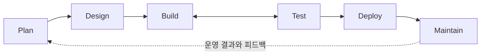

# OwnHands

**AI 코딩 에이전트가 만든 결과를 사람이 이해하고 검증하면서, 개발을 주도할 수 있게 하는 개발 시스템.**

> 🚧 **현재 상태: V2 전환 · 설계 단계**
> V1은 구현하고 병합했다. V2는 방향을 확정했고 **제품 기능은 아직 구현하지 않았다.**
> 무엇이 확정이고 무엇이 아닌지는 [결정 상태표](docs/v2/decisions.md)를 본다.

---

## 왜 만들었는가

AI 에이전트에 작업을 위임하면 결과는 빠르게 나온다. 문제는 그다음이다.

> AI가 만든 작업이 정말 요구를 만족했는가?
> 무엇을 확인했고 무엇을 확인하지 못했는가?
> 사람이 어떤 근거를 보고 판단해야 하는가?

**V1은 이 질문에 구조로 답했다.** Issue → Verification Spec → Baseline → Review → Evidence → Dashboard를 실제로 구현했다. `unobserved`와 `unknown`을 1급 상태로 두어, 모르는 것을 모른다고 표시할 자리를 먼저 만들었다.

## 실제 구현하며 한계를 발견했다

한계는 문서를 읽다가 안 것이 아니라 **직접 만들면서** 알게 됐다.

요구사항을 엄격하게 보장하려 할수록, 그것을 보장하는 **도구를 유지하는 일**이 커졌다. 특히 Dashboard에서는 원래 목적("작업을 이해하는 것")보다 접속·polling·캐시·페이지 상태·최신성·표현과 원본의 일치를 관리하는 부담이 더 컸다.

> **원래 원하던 개발 경험보다, 그것을 지원하는 별도 시스템의 운영 부담이 더 커졌다.**

⚠️ 이것은 "검증은 필요 없다"는 결론이 **아니다.** V1의 검증 원칙은 V2에서도 유지된다.
문제는 원칙이 아니라 그 원칙을 떠받치려고 직접 만들어 운영해야 했던 시스템의 크기였다.

→ 자세히: [프로젝트 여정](docs/story/project-journey.md) · [왜 V2인가](docs/story/why-v2.md)

---

## V2에서 무엇이 달라지는가

| | V1 | V2 |
|---|---|---|
| 설명 방식 | 상시 연결된 Dashboard | **요청할 때 생성하는 Explain** |
| 범위 | 검증(Test 단계)에 집중 | **SDLC 전체**를 연결 |
| 평가 대상 | 제품이 요구를 만족했는가 | **제품 + 제품을 만드는 Agent System** |
| 만들기 전 | 필요한 것을 직접 구현 | **공식 문서를 먼저 조사하고 안 만들 것을 결정** |
| 실행 플랫폼 | (당시 환경 전제) | **Codex-first**, 플랫폼별로 구체적으로 |

핵심 전환은 하나다.

> **"항상 연결된 최신 화면을 제공한다"는 책임을 기본 경로에서 제거한다.**

이 약속을 빼면 polling·캐시 최신성·재접속 복구가 기본 경로에서 사라진다.
대신 사용자가 개발하던 대화에서 필요할 때 Explain을 호출하고, 그 설명이 **언제 어떤 자료로 만들어졌고 무엇을 확인하지 않았는지**를 함께 밝힌다.

---

## 두 가지를 함께 개선한다

| 대상 | 질문 | 확인 방법 |
|---|---|---|
| 개발 중인 **제품** | 요구대로 구현됐는가? 기존 동작을 해치지 않았는가? | 검증 패턴 · 근거 · PR 리뷰 |
| 제품을 만드는 **Agent System** | 지침·Skill·Agent·정책·모델을 바꾼 뒤 일을 더 잘하게 됐는가? | Continuous Evals |



Explain은 특정 단계의 기능이 아니라 **모든 단계에서 쓰는 공통 기능**이다.

→ 자세히: [V2 개요](docs/v2/overview.md)

---

## 공식 근거를 중심에 둔다

| 판단 | 근거 |
|---|---|
| AI-native SDLC의 큰 틀 | [Anthropic AI-Native SDLC Playbook](https://claude.com/blog/the-ai-native-sdlc-playbook) |
| 실제 형식·기능·권한·제약 | [Codex 공식 문서](https://learn.chatgpt.com/docs) |
| 어떤 제품을 왜 만드는가 | 사용자 의도와 확정된 제품 방향 |

Playbook은 프로젝트를 **시작한** 계기가 아니라, 이미 하던 고민을 SDLC 전체 구조로 연결해 준 **V2의 전환 계기**다.
⚠️ Anthropic의 예시를 Codex의 지원 기능으로 취급하지 않는다. 두 근거의 역할이 다르다.

**조사 결과 (확인일 2026-09-16)**: Codex는 Skills · Hooks · Subagents · MCP · 샌드박스 · 지침 계층을 네이티브로 제공한다.
V1에서 직접 만들어 짊어졌던 것 중 일부는 **만들지 않아도 된다.**

→ [Anthropic Playbook 대응](docs/references/anthropic-playbook.md) · [Codex 공식 문서 확인](docs/references/codex-official.md)

---

## 로드맵

| 마일스톤 | 내용 | 상태 |
|---|---|---|
| [V2-M0](https://github.com/taejung3852/OwnHands/milestone/13) | Foundation & Source of Truth | 🔵 진행 중 |
| [V2-M1](https://github.com/taejung3852/OwnHands/milestone/14) | Codex-Native Foundation · **작은 Eval 시작** | 🚧 결정 이슈 열림 |
| [V2-M2](https://github.com/taejung3852/OwnHands/milestone/15) | Plan & Design | 🚧 |
| [V2-M3](https://github.com/taejung3852/OwnHands/milestone/16) | Build & Feedback Loop | 🚧 |
| [V2-M4](https://github.com/taejung3852/OwnHands/milestone/17) | Test & Assurance | 🚧 |
| [V2-M5](https://github.com/taejung3852/OwnHands/milestone/18) | Continuous Evals — **Eval 체계로 확장** | 🚧 |
| [V2-M6](https://github.com/taejung3852/OwnHands/milestone/19) | Deploy & Governance | 🚧 |
| [V2-M7](https://github.com/taejung3852/OwnHands/milestone/20) | Maintain & Closed Loop | 🚧 |

**평가는 M5에서 시작하지 않는다.** V2-M1부터 작게 돌리고, M5에서 체계로 확장한다.

⚠️ 마일스톤이 등록됐다는 것과 그 안의 설계가 확정됐다는 것은 다르다. 각 단계의 남겨둔 결정은 열려 있다.

→ 자세히: [로드맵](docs/v2/roadmap.md)

---

## 무엇이 확정이고 무엇이 아닌가

| ✅ 확정 | 🤔 / 💬 / ⏳ 미확정 |
|---|---|
| Codex-first, 공식 문서 중심 | Company 정책 우선순위 (사용자 생각) |
| 요청형 Explain | Skill 이름·수 (함께 결정) |
| clean-slate 설계 | 초기 Agent 역할·수 (함께 결정) |
| 초기 작은 Eval + M5 확장 | 다른 vendor 지원 방식 |
| 개인 전용으로 제한하지 않음 | Eval 지표·비용·gate |

→ **전체 목록: [결정 상태표](docs/v2/decisions.md)**

---

## 문서

| 시작점 | 내용 |
|---|---|
| **[📖 문서 인덱스](docs/README.md)** | 독자별 읽기 순서 |
| [결정 상태표](docs/v2/decisions.md) | ⭐ 확정 / 생각 / 미정 |
| [V2 개요](docs/v2/overview.md) | 큰 구조와 책임 |
| [로드맵](docs/v2/roadmap.md) | 실행 순서와 각 단계의 남겨둔 결정 |
| [개발 방법](docs/v2/development-method.md) | 각 단계 진행 방식 |
| [V1 기록](docs/history/v1.md) | 구현 범위·마일스톤·보존 기준 |

## 작업 관리

| 위치 | 용도 |
|---|---|
| **[#101 V2 전체 추적](https://github.com/taejung3852/OwnHands/issues/101)** | V2 작업의 입구 — 현재 상태와 하위 이슈 |
| [Issues](https://github.com/taejung3852/OwnHands/issues?q=is%3Aissue+label%3Av2) | V2 조사·결정 질문과 결과 (`v2` 라벨) |
| [Milestones](https://github.com/taejung3852/OwnHands/milestones) | 실행 단위 — V2는 [`V2-M0`~`V2-M7`](https://github.com/taejung3852/OwnHands/milestones) 등록 (V1 `M0`~`M8`은 별개) |
| [Project: OwnHands V2](https://github.com/users/taejung3852/projects/2) | 이슈 진행 상태 보기 |

현재 열린 V2 결정 이슈:

| 이슈 | 질문 | 상태 |
|---|---|---|
| [#102](https://github.com/taejung3852/OwnHands/issues/102) | Codex가 이미 제공하는 것은 무엇이고 무엇을 안 만들어도 되는가? | 🔍 조사 |
| [#103](https://github.com/taejung3852/OwnHands/issues/103) | Skill의 이름과 개수는 무엇인가? | 💬 함께 결정 |
| [#104](https://github.com/taejung3852/OwnHands/issues/104) | 초기 Agent 역할과 위임 조건은? | 💬 함께 결정 |
| [#105](https://github.com/taejung3852/OwnHands/issues/105) | 기본·조직 정책을 어떻게 연결하는가? | 🤔 생각 단계 |
| [#106](https://github.com/taejung3852/OwnHands/issues/106) | 초기 Eval을 어떻게 시작하고 M5에서 무엇을 확장하는가? | ⏳ 후속 결정 |

---

## V1은 어디에 있는가

V2는 clean-slate 설계다. V1 실행 자산(코드·Skills·테스트·패키지·MCP·플러그인 정의)과 원본 문서는 **현재 tree에서 제거했고, Git 태그에 보존했다.**

```
pre-v2-2026-09-16
```

기준 커밋 [`6d052ac`](https://github.com/taejung3852/OwnHands/commit/6d052acfeba2e0a971bfe11463a5c9b938abf65d) · [태그에서 보기](https://github.com/taejung3852/OwnHands/tree/pre-v2-2026-09-16)

> ⚠️ **이 태그는 V1의 완성본이나 정식 릴리스가 아니다.** 전환 직전 상태의 snapshot이다.

- **V1은 실패해서 제거한 것이 아니다.** 실제 구현을 통해 V2의 방향을 얻은 단계다.
- V1의 구현·검증 결과는 **V2의 완료 근거로 자동 승계되지 않는다.**
- 무엇을 만들었고 태그의 어디에 있는지는 [V1 기록](docs/history/v1.md), 아카이브 안내는 [docs/legacy/README.md](docs/legacy/README.md).

V1 추적 이슈 [#7](https://github.com/taejung3852/OwnHands/issues/7) · [#89](https://github.com/taejung3852/OwnHands/issues/89) · [#99](https://github.com/taejung3852/OwnHands/issues/99)는 2026-09-16에 **`not planned`로 종료**했다. 구현이 잘못돼서가 아니라 제품 방향이 바뀌었기 때문이며, **`완료`로 닫지 않았다.**

> V2는 아직 실행 가능한 제품이 없다. 설치 방법을 안내하지 않는다.
