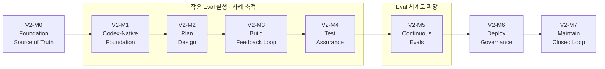

# V2 실행 로드맵

> ✅ **2026-09-16: 사용자가 8개 후보를 그대로 승인해 GitHub Milestone으로 등록했다.**
> 아래 각 단계에서 **남겨둔 결정**은 여전히 열려 있다. 마일스톤이 등록됐다는 것과
> 그 안의 설계가 확정됐다는 것은 다르다.
>
> 나중에 이슈로 거칠게 분해했을 때 너무 작거나 강하게 결합된 묶음은 합칠 수 있다.
> **그 판단은 사용자와 한다.**

---

## 로드맵은 세 밀도로 나뉜다

```text
README: 어디로 가는지 짧게
          ↓
docs/roadmap.md (이 문서): 왜 이 순서인지와 각 단계의 결과를 자세하게
          ↓
GitHub Project: 실제 Issue의 진행 상태를 시각적으로
```

**설명 원문은 이 문서다.** 날짜 근거가 없으면 Project의 시간축을 채우려고 시작일·완료일을 만들지 않는다.

---

## V1 마일스톤과 이름이 겹친다

이 저장소에는 **이미 V1의 M0~M8 마일스톤이 존재한다**(모두 closed).
V2는 혼동을 막기 위해 **`V2-M` 접두사**를 쓴다.

| | V1 (기존) | V2 |
|---|---|---|
| 예 | `M5 — Issue-based Review & Human Dashboard` ([#12](https://github.com/taejung3852/OwnHands/milestone/12)) | `V2-M5 — Continuous Evals` ([#18](https://github.com/taejung3852/OwnHands/milestone/18)) |
| 상태 | 등록됨, 모두 closed | 등록됨 (2026-09-16) |

**같은 번호라도 다른 것이다.** V1 기록은 [V1 기록](history/v1.md).

---

## 실행 순서



평가는 `V2-M5`에서 시작하지 않는다. `V2-M1`부터 작게 돌리고 `V2-M5`에서 체계로 확장한다.


### [V2-M0 — Foundation & Source of Truth](https://github.com/taejung3852/OwnHands/milestone/13)

- **목적·완료 결과**: V2 목적·공식 근거·Artifact chain·V1 경계·로드맵이 정리됨
- **선행**: 없음
- **남겨둔 결정**: 정리 작업과 제품 기반의 정확한 경계
- **현재 상태**: 🔵 **진행 중** — 이 문서 묶음이 그 산출물이다

### [V2-M1 — Codex-Native Foundation](https://github.com/taejung3852/OwnHands/milestone/14)

- **목적·완료 결과**: 공식 문서에 맞는 지침·Skill·Reference·Agent 구성 기준과 **초기 평가 사례**가 생김
- **선행**: V2-M0
- **남겨둔 결정**: 💬 **Skill 이름·수** ([#103](https://github.com/taejung3852/OwnHands/issues/103)), 💬 **초기 Agent 역할과 수** ([#104](https://github.com/taejung3852/OwnHands/issues/104)) — 사용자와 결정
- **열린 이슈**: [#102](https://github.com/taejung3852/OwnHands/issues/102) 조사 · [#103](https://github.com/taejung3852/OwnHands/issues/103) · [#104](https://github.com/taejung3852/OwnHands/issues/104) · [#106](https://github.com/taejung3852/OwnHands/issues/106) 평가 설계
- **착수 시 확인할 공식 자료**: [Codex 공식 문서](references/codex-official.md)의 AGENTS.md·Skills·Subagents 절, 그리고 아직 `미확인`으로 남은 항목
- **작은 Eval**: ✅ 여기서부터 시작한다

### [V2-M2 — Plan & Design](https://github.com/taejung3852/OwnHands/milestone/15)

- **목적·완료 결과**: 문제/의도에서 `intent.md`, 정책을 적용한 `spec.md`로 이어지는 흐름을 **사용함**
- **선행**: V2-M1
- **남겨둔 결정**: 정책 선택·추가·예외·충돌 ([#105](https://github.com/taejung3852/OwnHands/issues/105) — 🤔 사용자 생각 단계), 산출물 세부 형식

### [V2-M3 — Build & Feedback Loop](https://github.com/taejung3852/OwnHands/milestone/16)

- **목적·완료 결과**: Codex의 계획·구현 기능과 `plan.md`, 실행·확인·수정 루프가 연결됨
- **선행**: V2-M2
- **남겨둔 결정**: 네이티브 기능과 직접 구현할 최소 부분
- **착수 시 확인할 공식 자료**: Codex의 Plan mode 대응 기능 (현재 `미확인`)

### [V2-M4 — Test & Assurance](https://github.com/taejung3852/OwnHands/milestone/17)

- **목적·완료 결과**: 상황별 검증 Reference, 전후 관찰, 최종 검수의 역할이 정리되고 **사용됨**
- **선행**: V2-M3
- **남겨둔 결정**: 필요한 Evidence 수준·검수 역할·구체 기록 방식
- **참고**: V1이 가장 깊이 구현한 영역이다. 승계가 아니라 **재배치**다. → [V2 개요 §5](overview.md)

### [V2-M5 — Continuous Evals](https://github.com/taejung3852/OwnHands/milestone/18)

- **목적·완료 결과**: **초기부터 축적한 사례를** 대표 task set·비교·회귀 평가 체계로 **확장함**
- **선행**: V2-M1~M4에서 축적한 실제 사례
- **남겨둔 결정**: 지표·반복·비용·자동 실행·gate의 상세
- ✅ **확장 지점이라는 것은 확정이다. 평가의 시작 지점이 아니다.**

### [V2-M6 — Deploy & Governance](https://github.com/taejung3852/OwnHands/milestone/19)

- **목적·완료 결과**: PR 검토·CI/CD·Human Gate·권한과 통제를 연결함
- **선행**: V2-M4 (검증), V2-M5 (평가 기준)
- **남겨둔 결정**: 실행 환경·승인·Hook 배치의 상세
- **Research Gate**: Codex review·sandboxing/approvals·non-interactive/CI·managed policy·Hooks 공식 기능과 OwnHands 공백을 확인함. 내부 연결 방식은 아직 미정 → [M6 Research](research/m6-deploy-governance.md), [#144](https://github.com/taejung3852/OwnHands/issues/144)

### [V2-M7 — Maintain & Closed Loop](https://github.com/taejung3852/OwnHands/milestone/20)

- **목적·완료 결과**: 운영/사용 피드백이 다음 Intent와 Eval로 이어짐
- **선행**: V2-M6
- **남겨둔 결정**: 실제 signal·자동/수동 경계

---

## 왜 이 순서인가

**제품의 Stage 순서와 구현 순서는 같을 필요가 없다.** 그런데 이 순서는 대체로 Stage 순서를 따른다. 이유가 있다.

| 이유 | 설명 |
|---|---|
| 기반이 먼저다 | V2-M1(지침·Skill·Agent 구성)이 없으면 이후 모든 단계가 담길 곳이 없다 |
| 산출물이 연쇄된다 | `intent.md` → `spec.md` → `plan.md`는 실제로 앞이 있어야 뒤가 생긴다 |
| 평가는 예외다 | V2-M5는 순서상 5번째지만, **평가 자체는 V2-M1부터 작게 시작한다** |

> **마일스톤 하나는 파일 하나가 아니라 의미 있는 완료 목표다.**
> 반대로 Stage 이름만으로 불필요한 마일스톤을 늘리지 않는다.
> 나중에 이슈로 거칠게 분해했을 때 너무 작거나 강하게 결합된 묶음은 합칠 수 있다. **그 판단은 사용자와 한다.**

---

## Eval 도입 범위

⏳ 초기 Eval의 **과제 수·스크립트 구조는 지금 정하지 않는다.**
✅ **M5까지 평가를 미루지 않는다는 결정만 분명하다.**

---

## 마일스톤 본문에 담을 정보

실제 등록 시 각 마일스톤 설명에는 필요한 만큼만 담는다.

```text
왜 존재하는가
선행 조건
완료하면 무엇을 할 수 있는가
범위와 하지 않을 것
착수 시 확인할 공식 자료
작은 Eval 또는 실제 확인 방향
해당 이슈에서 나중에 정할 질문
관련 문서와 Issue
```

---

## 각 마일스톤의 진행 방식

```text
Research → Native 기능 대응 → 수단 선택 → 만들지 않을 것 결정
→ 최소 구현 → 실제 작업/Eval로 확인
```

상세는 [개발 방법](development-method.md).

---

## 현재 상태

| 항목 | 상태 |
|---|---|
| 로드맵 정리 | ✅ 이 문서 |
| GitHub Milestone 등록 | ✅ 2026-09-16 등록 ([전체](https://github.com/taejung3852/OwnHands/milestones)) |
| V2-M0 작업 | 🔵 진행 중 |
| V2-M1 이후 | 🚧 미착수 (결정 이슈는 열림) |
| 각 단계의 '남겨둔 결정' | ⏳ 여전히 열려 있음 |

---

## 관련 문서

- [V2 개요](overview.md) · [결정 상태표](decisions.md) · [개발 방법](development-method.md)
- [V1 기록](history/v1.md) — 기존 M0~M8 마일스톤
