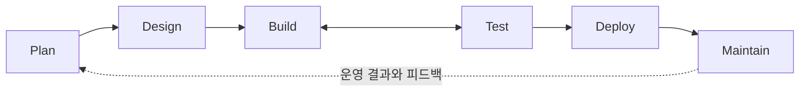

# V2 개요 — 무엇을 만들려는가

> 이 문서는 **책임 관계의 지도**다. 구현 완료 보고가 아니다.
> 2026-09-16 기준 V2의 제품 기능은 모두 미구현이다. → [결정 상태표](decisions.md)

---

## 1. 두 가지를 함께 개선하는 도구

OwnHands V2는 서로 다른 두 질문에 답한다. **이 둘을 섞지 않는 것이 V2의 출발점이다.**

| 대상 | 질문 | 확인 방법 |
|---|---|---|
| **개발 중인 제품** | 요구대로 구현됐는가? 기존 동작을 해치지 않았는가? | 검증 패턴 · 근거 · PR 리뷰 |
| **제품을 만드는 Agent System** | 모델·지침·Skill·Agent·정책·도구 설정을 바꾼 뒤 일을 더 잘하게 됐는가? | Continuous Evals |

V1은 앞의 질문만 다뤘다. **뒤의 질문을 다루지 않으면, 도구를 바꿔도 나아졌는지 알 수 없다.**

> "내 OwnHands 스킬은 나랑 함께 성장하는 개발 도구가 될거야."

---

## 2. 제품의 논리적 SDLC



| Stage | 책임과 주요 산출물 |
|---|---|
| **Plan** | 문제·목표·제약·범위를 정리한다. `intent.md`가 중심이다. |
| **Design** | Intent와 적용 정책을 바탕으로 요구·구조·수용 조건을 정한다. `spec.md`가 중심이다. |
| **Build** | 코드베이스에 맞는 구현 계획을 정리하고 구현·실행·확인·수정을 반복한다. `plan.md`와 코드가 중심이다. |
| **Test** | 필요한 검증 패턴을 적용하고, 확인한 결과·근거·남은 빈틈을 구분한다. |
| **Deploy** | PR 검토·자동 검사·사람의 판단·배포 권한과 절차를 연결한다. |
| **Maintain** | 운영·사용·개발 경험에서 다음 Intent와 Eval 사례로 이어지는 피드백을 얻는다. |

**두 가지 주의**

1. 이 지도는 **책임 구분**이다. 모든 작은 작업에 여섯 번의 긴 의식이나 승인을 강제하는 뜻이 아니다.
2. **제품의 Stage 순서와 실제 구현 마일스톤 순서는 같을 필요가 없다.** → [로드맵](roadmap.md)

---

## 3. 세 문서는 다른 질문에 답한다

| 문서 | 질문 |
|---|---|
| `intent.md` | **왜**, 무엇을 하려는가? |
| `spec.md` | **어떤 설계로** 무엇을 만족시킬 것인가? |
| `plan.md` | **현재 코드에서 어떻게** 구현할 것인가? |

⏳ 정확한 저장 경로·메타데이터·자동화 규칙은 **미정**이다.

> ⚠️ Plan Stage와 코딩 에이전트의 계획 기능을 혼동하지 않는다.
> 특정 호스트의 Plan Mode를 사용했다고 프로젝트의 `plan.md` 저장과 검토가 자동으로 끝난다고 가정하지 않는다.
> Codex에서의 실제 방법은 공식 문서 기반 후속 이슈에서 결정한다.

---

## 4. Skill · Reference · Agent · Script는 서로 다르다

**V1에서 부담이 커진 큰 원인 중 하나가 이 구분 없이 진행한 것이다.**

| 구성 | 책임 |
|---|---|
| **프로젝트 지침** | 공통 맥락과 필요한 기본 작업 원칙 |
| **Skill** | 언제 무엇을 수행하고 어떤 결과를 내야 하는지 안내 |
| **Reference** | 특정 상황에서 필요한 자세한 지식과 방법 |
| **Agent/Subagent** | 독립된 역할·맥락·도구를 받아 실제 작업 수행 |
| **Tool·Script** | 조회·실행·계산·측정 등 실제 동작 |
| **Hook·권한·CI** | 실행 경계·자동 검사·정책 통제 |
| **Eval** | Agent System 변경 전후의 작업 결과 비교 |

**두 가지 주의**

1. **지침을 썼다는 사실과 기술적으로 강제된다는 사실은 다르다.** Skill에 "하지 마라"라고 쓰는 것과 Hook이 실제로 차단하는 것은 다른 층이다.
2. 모든 기능을 스크립트로 만들지도, 스크립트를 무조건 금지하지도 않는다.

> Codex는 Skills·Hooks·Subagents·MCP를 네이티브로 제공한다(확인일 2026-09-16).
> 이 구분을 **직접 구현할 필요는 없고, 무엇을 어디에 둘지 결정하면 된다.** → [Codex 공식 문서](../references/codex-official.md)

💬 Skill의 이름·수와 초기 Agent 역할·수는 **사용자와 결정한다.**

---

## 5. 검증 지식은 필요할 때 읽는다

논의한 구조 **예시**:

```text
test/
├── SKILL.md
└── references/
    ├── regression.md
    ├── before-after.md
    ├── tdd-red-green.md
    └── comparison.md
```

**핵심은 각 작업에서 필요한 참고 자료만 읽는 것이다.** 모든 검증 지식을 항상 로드하지 않는다.

> ⚠️ 위 구조는 논의한 예시다. **최종 Skill 이름과 파일 배치가 승인된 것이 아니다.** → 💬 [결정 상태표](decisions.md)
> 참고: `SKILL.md` + `references/` 디렉터리 구조 자체는 Codex가 네이티브로 지원한다.

### Baseline과 Review의 재배치

| 개념 | 뜻 |
|---|---|
| **Baseline** | 변경 **전** 상태와 관찰 |
| **Review** | 변경 **후** 요구 충족과 근거를 검토하는 작업 |

V2에서는 이것을 **필요한 전후 비교 전략**으로 재배치한다. **V1의 Formal Review·저장소 계약을 일괄 승계하지 않는다.**

**Before가 필요한 작업**(버그 수정, 성능 비교, 회귀 주장)에서는 **구현 전에 기준을 확보한다.**
Before가 없는데 전후 개선을 증명했다고 쓰지 않는다.

### 네 가지는 다른 책임이다

```text
작업 중 Feedback loop   →  구현하면서 스스로 확인
별도 맥락의 최종 Verifier →  다른 맥락에서 결과 검수
PR Review               →  변경 자체에 대한 검토
Agent System Eval       →  시스템이 나아졌는지 비교
```

이것을 하나로 합치지 않는다.

---

## 6. Explain은 공통 기능이다

```text
사용자의 명시적 요청
        ↓
관련 Intent / Spec / Plan / 코드 / 검증 / Eval 자료
        ↓
현재 상황에 필요한 Reference 선택
        ↓
설명 작성, 필요하면 별도 검수
        ↓
대화에 한두 문장  +  그림 위주의 HTML 페이지
```

> 출력 형태는 2026-09-17에 **HTML 페이지를 기본으로** 확정했다. 대화에는 한두 문장만 두고
> 나머지는 페이지로 낸다. 사람이 가장 짧은 시간에 이해하는 것이 이 기능의 판정 기준이기 때문이다.
> → [결정 상태표](decisions.md) · 구현은 `.agents/skills/explain/`

**V2에서 바뀐 것**

> "항상 연결된 최신 화면을 제공한다"는 책임을 기본 경로에서 제거한다.

| 하지 않는 것 | 이유 |
|---|---|
| ❌ 전용 Dashboard Stage로 만들기 | Explain은 모든 단계에서 쓰는 공통 기능이다 |
| ❌ 모든 설명에 작성·검수 Agent 무조건 연쇄 호출 | 필요할 때만 검수한다 |
| ❌ 설명 이후 변경의 자동 반영 약속 | 이 약속이 V1의 운영 부담을 만들었다 |

설명에는 **생성 당시의 자료와 한계**를 밝힌다.
정식 Review가 없어도 설명할 수 있지만, **그 설명을 정식 검증 결과처럼 표현하지 않는다.**

---

## 7. 정책과 실행 통제

기본 정책에서 조직 정책으로 전환할 때 **공통 개발 흐름을 다시 구현하지 않도록** 연결 지점을 설계하려 한다.

> 🤔 **회사 정책 우선순위와 예외 처리 알고리즘은 아직 만들지 않는다.**
> Company 우선 정책은 사용자의 **현재 생각**이며 확정 규칙이 아니다. → [결정 상태표 §2](decisions.md)

### Hooks의 역할 (방향)

| 단계 | 역할 |
|---|---|
| **Build** | 허용되지 않은 변경·실행에 대한 guardrail |
| **Test** | 합의한 검증을 우회하지 않도록 하는 guardrail |
| **Deploy** | 승인·권한·release gate와 연결 |

**구분해야 할 것**

- 실행 **전 차단** ↔ 실행 **후 탐지**
- Skill의 **지식** ↔ 실제 **권한**
- 로컬 에이전트 Hook ↔ CI/CD의 **배포 통제**

> Codex의 hook 이벤트 이름은 확인했다(`PreToolUse`, `PermissionRequest`, `PostToolUse` 등).
> ⚠️ **이벤트가 존재한다는 것이 OwnHands의 hook이 구현·설계됐다는 뜻은 아니다.** ⏳ 후속 설계다.

---

## 8. Continuous Evals

```text
실제 작업 경험
      ↓
재현 가능한 대표 과제
      ↓
기존 Agent System과 변경 후보 비교
      ↓
품질·누락·사람 부담·시간/비용 확인
      ↓
유효한 개선은 채택, 그렇지 않으면 수정 또는 제외
```

**평가 대상**에는 모델, 프로젝트 지침, Skills/References, Agent/Subagent 정의, 정책, 도구 설정, 나중에 연결될 Hooks 등이 포함될 수 있다.

### 도입 시점은 확정됐다

| 시기 | 역할 |
|---|---|
| **초기 (`V2-M1`~`V2-M4`)** | 실제 Skill·지침·workflow를 대표 작업으로 확인하고 **사례·결과를 축적**한다. |
| **M5** | 축적한 과제를 바탕으로 task set·기준선·지표·replay·비교·회귀 판단을 **체계화**한다. |

> "초기에 작은 Eval을 넣고 M5에서 확장 하는 방식으로 가자."

| 하지 않을 것 |
|---|
| ❌ M5에서 **처음** 평가를 시작하는 계획으로 되돌리기 |
| ❌ M1부터 완전한 Eval **플랫폼** 만들기 |

### 지표는 아직 후보다

성공률·검증 누락·불필요한 수정·사람 개입·토큰·시간·오차단은 **지표 후보**다.
⏳ 수치나 채택 알고리즘을 고정하지 않는다.

> ⚠️ 과거 작업의 시작 상태와 결과를 구분한다.
> **동일 캐시를 여러 번 읽은 것을 독립 생성 평가로 세지 않는다.**

---

## 관련 문서

- [로드맵](roadmap.md) — 어떤 순서로 만들 것인가
- [결정 상태표](decisions.md) — 확정 / 생각 / 미정
- [개발 방법](development-method.md) — 각 단계를 어떻게 진행하는가
- [Anthropic Playbook 대응](../references/anthropic-playbook.md) · [Codex 공식 문서](../references/codex-official.md)
